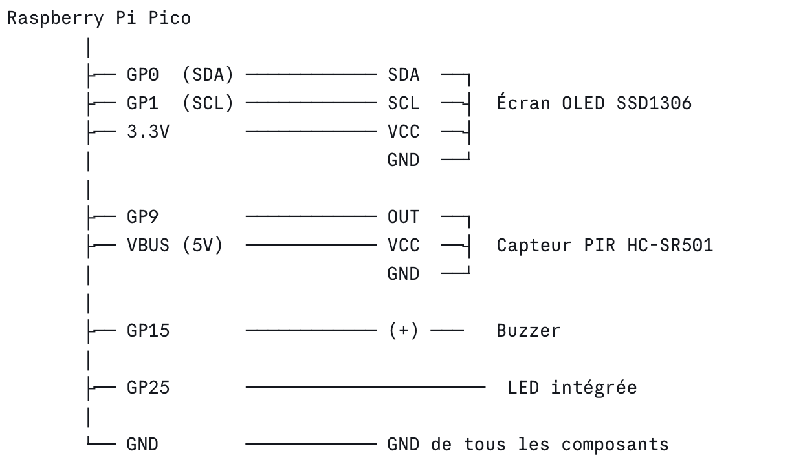

code:

from machine import Pin, I2C, PWM
import ssd1306
import time
import utime

# ─── Initialisation des composants ───────────────────────────────────────────

# Écran OLED (I2C sur GP0=SDA, GP1=SCL)
i2c = I2C(0, sda=Pin(0), scl=Pin(1), freq=400000)
oled = ssd1306.SSD1306_I2C(128, 64, i2c)

# Capteur PIR (GP9)
pir = Pin(9, Pin.IN)

# Buzzer PWM (GP15)
buzzer = PWM(Pin(15))
buzzer.duty_u16(0)  # silencieux au démarrage

# LED intégrée (GP25)
led = Pin(25, Pin.OUT)

# ─── Fonctions utilitaires ───────────────────────────────────────────────────

def afficher(ligne1, ligne2="", ligne3=""):
    """Affiche jusqu'à 3 lignes sur l'écran OLED."""
    oled.fill(0)
    oled.text(ligne1, 0, 0)
    oled.text(ligne2, 0, 20)
    oled.text(ligne3, 0, 40)
    oled.show()

def bip(freq=1000, duree_ms=200):
    """Émet un bip court au buzzer."""
    buzzer.freq(freq)
    buzzer.duty_u16(30000)
    utime.sleep_ms(duree_ms)
    buzzer.duty_u16(0)
    utime.sleep_ms(50)

def alarme_sonore():
    """Séquence sonore d'alarme : 3 bips aigus."""
    for _ in range(3):
        bip(freq=2000, duree_ms=150)
        utime.sleep_ms(100)

def bip_confirmation():
    """Bip grave de confirmation (démarrage ou fin d'alarme)."""
    bip(freq=500, duree_ms=300)

# ─── Démarrage ───────────────────────────────────────────────────────────────

afficher("Systeme alarme", "Initialisation...", "")
led.value(1)
bip_confirmation()
utime.sleep(1)
led.value(0)
afficher("Systeme alarme", "Pret !", "En surveillance...")
print("Système démarré. Surveillance en cours...")

# ─── Variables d'état ────────────────────────────────────────────────────────

en_alarme = False
compteur_mouvements = 0
DELAI_ALARME_S = 5        # durée minimale de l'alarme (secondes)
temps_derniere_alarme = 0

# ─── Boucle principale ───────────────────────────────────────────────────────

while True:
    maintenant = utime.time()
    mouvement = pir.value()

    if mouvement:
        compteur_mouvements += 1
        print(f"Mouvement détecté ! (total: {compteur_mouvements})")

        if not en_alarme:
            # Déclenche l'alarme
            en_alarme = True
            temps_derniere_alarme = maintenant
            print(">>> ALARME DÉCLENCHÉE <<<")

        # Affichage alerte + LED clignotante
        afficher("! MOUVEMENT !", f"Nb: {compteur_mouvements}", "ALARME ACTIVE")
        led.value(1)
        alarme_sonore()
        led.value(0)

    else:
        # Pas de mouvement détecté
        if en_alarme:
            # Vérifie si le délai d'alarme est écoulé
            if (maintenant - temps_derniere_alarme) >= DELAI_ALARME_S:
                en_alarme = False
                print("Alarme désactivée.")
                afficher("Alarme", "desactivee", f"Total: {compteur_mouvements} mvt")
                led.value(1)
                bip_confirmation()
                utime.sleep(0.5)
                led.value(0)
                utime.sleep(2)
                afficher("En surveillance...", f"Total: {compteur_mouvements}", "")
            else:
                # Alarme encore active (délai non écoulé)
                afficher("Surveillance...", "Calme detecte", "Attente fin alarme")
                led.value(0)
        else:
            # Surveillance normale
            afficher("En surveillance...", f"Mvts: {compteur_mouvements}", "RAS")
            led.value(0)

        print("Rien.")

    time.sleep(0.5)

Projet Alarme avec Détection de Mouvement 

Description:

Notre projet est un système d'alarme avec détection de mouvement. Quand quelqu'un passe devant le capteur, l'écran affiche "ALARME" et le buzzer fait du bruit. On a utilisé une Raspberry Pi Pico pour faire fonctionner tout le système.

Matériel utilisé (liste des composants):

Raspberry Pi PicoLe cerveau du projet,execute le code Capteur 

PIR (HC-SR501)Detecte les mouvements

Écran OLED SSD1306 (128x64), Affiche l'état de l'alarme

Buzzer actif Fait le son quand alarme déclenchée

LED intégrée (GP25)Clignote lors d'une alerte

Nouveau composant : 
l'écran OLED SSD1306

L'écran  est le nouveau composant qu'on a ajouté par rapport au projet de base.

Comment il fonctionne :

L'écran OLED utilise le protocole I2C pour communiquer avec la Raspberry Pi Pico. I2C c'est un protocole qui permet de faire passer des données avec seulement 2 fils (SDA et SCL). L'écran fait 128x64 pixels 

Son rôle dans le projet :

Il affiche en temps réel l'état du système : soit "En surveillance..." quand tout va bien, soit ! MOUVEMENT ! avec le nombre de mouvements détectés quand l'alarme est active. Ca permet de voir ce qu'il se passe sans avoir besoin d'un ordinateur branché.

Schéma de câblage:

Explication du code:

Le code est découpé en plusieurs parties :
    Initialisation : On configure tous les composants au démarrage (écran, capteur, buzzer, LED).
Fonctions utilitaires :

afficher() : efface l'écran et écrit jusqu'à 3 lignes de texte

bip() : fait un son court avec le buzzer en réglant la fréquence

alarme_sonore() : enchaine 3 bips aigus pour signaler un mouvement

bip_confirmation() : bip grave pour indiquer que le système est prêt

Boucle principale : Toutes les 0,5 secondes, on vérifie si le capteur PIR détecte un mouvement. Si oui, l'alarme se déclenche, l'écran affiche l'alerte et le buzzer s'active. Si plus de mouvement pendant 5 secondes, l'alarme se désactive automatiquement.

